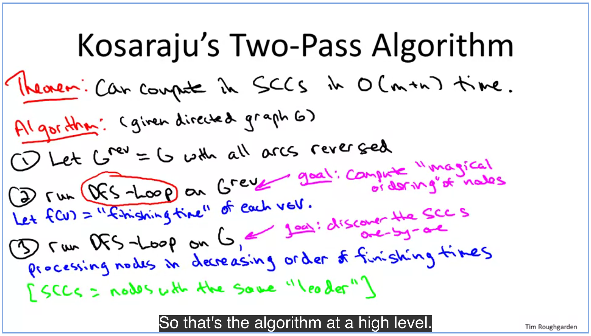

# Depth First Search

> Explore aggressively, only backtrack when necessary

- Computes a topological ordering of a directed acyclic graph

- Computes strongly connected components of directed graphs

## Implementation

```psydo
depthFirstSearch(graph G, startVertex s) {
    mark s as explored
    for every edge (s, v):
        if v unexplored:
            depthFirstSearch(G, v)
}
```

## Topological Sort

Definition: A topological ordering of a directed graph `G` is a labelling `f` of G's nodes such that:

1. The `f(v)`'s are the set `{1,2,...,n}`

2. `(u,v) is directed edge of G => f(u) < f(v)` (all edges go forward)

Note: G can not have a directed cycle

If there is no cycle, you 100% can compute a topological ordering in O(m+n) time

Note: Every directed acyclic graph has a "sink vertex" (an end)

To compute topological ordering (general):

```psydo
let v be a sink vertex of G
set f(v) = n
recurse on G-{v}
```

Compute it using depthFirstSearch:

```psydo
topoViaDepthFirst(graph G) {
    mark all nodes unexplored
    currentLabel := len(G) // to keep track of ordering
    for each vertex (v) of G:
        if v not yet explored:
            depthFirstSearch(G, v)
}

depthFirstSearch(graph G, startVertex s) {
    mark s as explored
    for every edge (s, v):
        if v unexplored:
            depthFirstSearch(G, v)
    set f[s] /* this is where is lives in the topological ordering */ = currentLabel
    currentLabel--
}
```

## Strongly connected components of directed graphs

A graph is "strongly" connected if you can get from any one point to any other point and vice versa

Note: if you invoke DFS inside of a strongly connected component it may find the full component and nothing else or all the way to finding the whole graph. It depends.

We make out odds 100% with a slick preprocessing step to find exactly where we should call DFS from...

 ### Kosaraju's two pass algorithm

Can compute strongly connected components of directed graphs in O(m+n) time



```psydo
kosarajuTwoPass(G graph) {
    let G_rev := G with all arcs reversed // or see next note
    order := dfsLoop(G_rev) // or run on original graph while going across arcs backwards
    switch the node names with there index in order
    dfsLoop(G)
    count number of groups with matching leaders to find SCC's and their counts
}
```

```psydo
dfsLoop(G graph) []int { // assume nodes are labelled 1 to n
    finishingTimes := make([]int, 0, len(G)) // ONLY ON FIRST PASS
    countOfNodesProcessed = 0 // ONLY ON FIRST PASS
    leader = null // most recent vertex from which a DFS was initiated // ONLY ON SECOND PASS

    for i=n down to 1 {
        if i !explored {
            leader = G[i]
            depthFirstSearch(G, i)
        }
    }

    return finishingTimes
}

depthFirstSearch(G graph, i int) {
    mark graph[i] as explored // for the entirity of dfsLoop
    graph[i].leader = leader // from the parent loop
    for every edge (s, v):
    if v unexplored:
        depthFirstSearch(G, v)
    countOfNodesProcessed++
    finishingTimes[i] = countOfNodesProcessed
}
```

The groups with matching leaders become the strongly connected components

#### Analysis

All directed graphs have a metagraph made up of the graph's SCC's that is acyclic

These SCC's are revealed by deleting sink SCC's one at a time in order

The order is revealed because the first iteration labels roughly from biggest to smallest sinks. It's pretty complex, so just look it up for full notes

##### other note

Given an adjacency-list representation of a directed graph, where each vertex maintains an array of its outgoing edges (but *not* its incoming edges)
