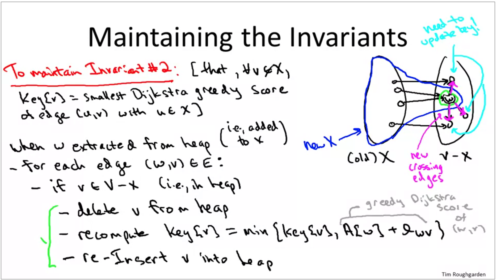

# Dijkstra's Shortest Path

The problem: Single-Source Shortest Paths

```math
Input: Directed graph G = (V,E). 
- Each edge has nonnegative length l.
- Source vertex S

Output: for each v -> v, compute L(v) := length of a shortest s-v path in G
```

BFS can solve for shortest path if every edge has equal length, Dijkstra's algorithm handles different edge weights.

## Implementation

```psydo
X = []all nodes we have looked at
while we have not looked at all the edges:
    scan edges whose tails we have already looked at but heads we have not looked at
    Compute Dijkstra's greedy score: The path distance to the tail + the edge length to the next head (do this for all remaining unexplored edges for nodes in X (ones where tail is in X but head is not))
    Whatever edge has the smallest score, add that head to X and store its score as shortest path Ex: [S: 0, V: 0+1, X: 0+1+3] <- the path is naturally stored as well

```

## Proof (by induction)

Basically, for each node you pick the shortest path to the next node and add them together so every step is 100% correct as long as there are no negative edges

> All Previous Iterations are correct

## With heap data structure

Previous implementation above would run in O(m*n)

Heap structure can reduce runtime

### Heap data structure

Conceptually: A perfectly balanced binary tree

Heap Property (min tree): at every node, key <>= children's keys

Extract min by swapping up last leaf and bubbling down and insert by bubbling up `O(mlogn)`

### Back to the algorithm

1. Elements in heap = vertices of V-X (X starts with just S)

2. Key of a vertex [v] = smallest Dijkstra greedy score of an edge with vertex V as it's head

```psydo
for each edge outgoing from w (v):
    if head of edge is not in X:
        delete v from heap
        update the key in constant time and re-insert into the heap (this can only change in one way - going smaller)
```



All of the work we do is through the heap api, so the running time is reduced to `O(mlogn)` (Number of heap operations is O(m))

